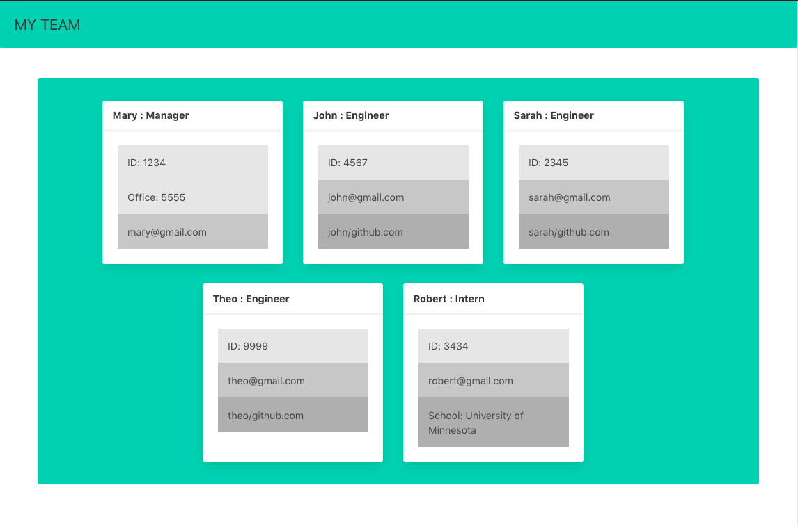

# Team-Profile-Generator

[Link to full length video](https://drive.google.com/file/d/1MxG0UuNeVwjW31c5Ptn3JahLEVHI1amk/view)
## Description
Enter the names, roles, and other information about your team members from the command line and receive a dynamically created web dashboard.
## Installation
Run `npm i` on your machine to install dependencies.
## Tests
Tests completed using Jest. Running `npm i` will install what is needed for the tests.
## License
Licensed under the [WTFPL](http://www.wtfpl.net/about/) license.